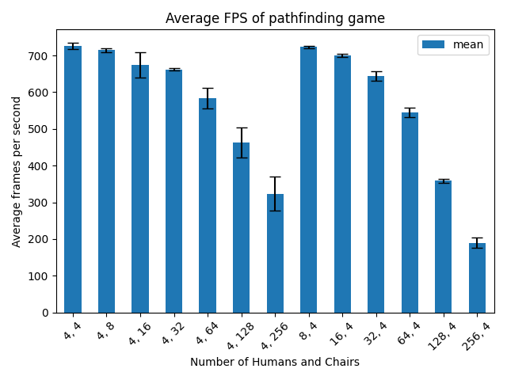
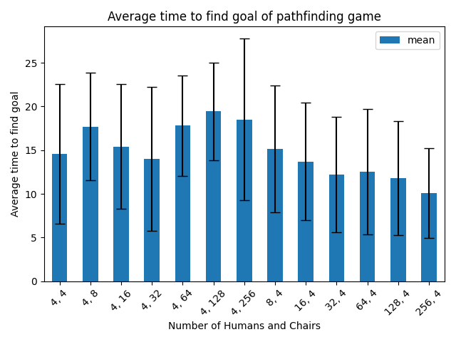

# COMP 521 Assignment 3 Pathfinding Performance

## Grid

The grid of nodes is automatically generated at runtime based on a grid
size input in the inspector. I've added gizmos for the gridsize in order
to fit it on the ground plane.

Each node checks if it is Clear with a Physics.CheckSphere call only
when requested to do so.

## Humans

Humans pathfind with an A\* pathfinding script to avoid nodes that are
used by chairs or other humans.

They deal with dynamic objects only when entering collisions to save on
execution time. Technically it might be more optimal if each human
recomputed their path either every so often (as chairs might have moved
out of the way), but I assume that the best path at the time of
computing is good enough.

To deal with dynamic objects, they just need to re-run A\* as the
implementation recomputes node occupation.

## Chairs

Chairs pathfind by simply moving towards the closest human. It finds all
colliders in a range around the chair, find the closest and start moving
towards it. These don't really need to deal with dynamic objects as they
can't pass other chairs. So when they encounter an obstacle, its one of
3 cases:

1.  A human: they're doing their job, nothing to do
2.  A chair going in the same direction: nothing to do, they are chasing
    the same human and going the same speed so avoiding each other does
    nothing
3.  A chair going in a different direction: nothing to do, collision
    will handle itself through Unity RigidBody

# Performance

I ran multiple tests to verify performance across a range of
permutations of humans and chairs.

The experiments were conducted as follows: the game was played on a 50
by 50 grid, the humans and chairs spawning on random tiles across the
plane. 4 iterations of the game were played out for 30 seconds each
time. Resetting the entire game at the end of the timer. I then
automatically scaled up the number of humans or chairs and reran the 4
simulations with the new numbers. I then took the average from each of
the groups and plotted them with python. The code to run the experiments
can be found in the FPSCounter.cs file.

Pathfinding starts slowing down the game as the number of humans goes
up. As I did not multi-thread the operation, it runs up to 256 A\*
searches at once when the goal changes positions. And it's the same
problem as the number of chairs goes up, as humans must recompute their
path every time, they enter contact with a chair.

As for the time to reach the goal, obviously the more humans there are,
the higher the chance one of them will be spawned close to the goal. And
the more chairs there are, the longer it will take for one of the 4
chairs to reach the goal.

The standard deviation on the time to find the goal is obviously very
large as they can reach the goal multiple times in 30 seconds. And since
they're randomly positioned at the beginning, all the of possible goal
positions will be at an equally distributed range of distances from the
humans. But as time goes on, the humans will group together as they
search the goals, meaning that goal nodes will be either equally close
or far to each human. This can therefore produce longer times to reach
the goal compared to when they're randomly spaced out on the grid.

When humans are randomly spaced out on the grid, chances are at least
one of them will be close to the goal node. When they're grouped
together, if the node is far from the group, no one will get there
quickly, which means on average, as a simulation goes on, the chances of
a very long time to reach the node grows longer.

